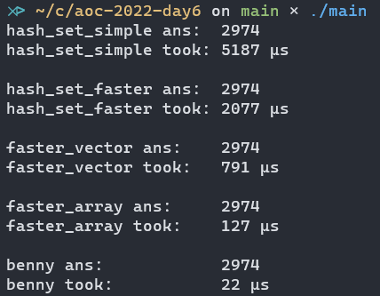

# Advent Of Code 2022 Day 6 Benchmarks

Different solution implementations for the Advent Of Code 2022 Day 6 Part 2 problem in C++ (Find 14 distinct characters in a string, return the index after the window). Idea from ThePrimeagen's [This Algorithm is 1,606,240% FASTER](https://www.youtube.com/watch?v=U16RnpV48KQ) YouTube video.

## Benchmarks



## Summary

| Data Structure/Algorithm | Runtime   | Scale    |
|--------------------------|-----------|----------|
| Hash Set (simple)        | 5187 µs   | 1        |
| Hash Set (faster)        | 2077 µs   | 2.497352 |
| Vector                   | 791  µs   | 6.557522 |
| Array                    | 127  µs   | 40.84252 |
| Bit Mask (Benny's)       | 22   µs   | 235.7727 |

## Solution Implementations

### Hash Set (Regular)

```c++
int hash_set_simple(const std::string &input) {
  for (size_t i = 0; i <= input.size() - 14; ++i) {
    std::unordered_set<char> window(input.begin() + i, input.begin() + i + 14);
    if (window.size() == 14) {
      return i + 14;
    }
  }
  return -1;
}
```

### Hash Set (Faster, insert one at a  time)

```c++
int hash_set_faster(const std::string &input) {
  for (size_t i = 0; i <= input.size() - 14; ++i) {
    std::unordered_set<char> chars;
    for (size_t j = i; j < i + 14; ++j) {
      if (chars.count(input[j]) != 0) {
        break;
      }
      chars.insert(input[j]);
    }
    if (chars.size() == 14) {
      return i + 14;
    }
  }
  return -1;
}
```

### Vector

```c++
int faster_vector(const std::string &input) {
  for (size_t i = 0; i <= input.size() - 14; ++i) {
    std::vector<char> chars;
    chars.reserve(14);
    for (size_t j = i; j < i + 14; ++j) {
      if (std::find(chars.begin(), chars.end(), input[j]) != chars.end()) {
        break;
      }
      chars.push_back(input[j]);
    }
    if (chars.size() == 14) {
      return i + 14;
    }
  }
  return -1;
}
```

### Array

```c++
int faster_array(const std::string &input) {
  for (size_t i = 0; i <= input.size() - 14; ++i) {
    char chars[14];
    bool unique = true;
    size_t arr_idx = 0;
    for (size_t j = 0; j < 14; ++j) {
      for (size_t k = 0; k < arr_idx; ++k) {
        if (chars[k] == input[i + j]) {
          unique = false;
          break;
        }
      }
      if (!unique) break;
      chars[arr_idx] = input[i + j];
      ++arr_idx;
    }
    if (unique) {
      return i + 14;
    }
  }
  return -1;
}
```

### Bit Mask

```c++
inline uint32_t count_ones(uint32_t n) {
  return __builtin_popcount(
      n);  // GCC/Clang built-in function to count set bits
}

int benny(const std::string &input) {
  uint32_t mask = 0;
  for (size_t i = 0; i < 13; ++i) {
    mask ^= 1 << (input[i] % 32);
  }
  for (size_t i = 0; i <= input.size() - 14; ++i) {
    uint8_t first = input[i];
    uint8_t last = input[i + 13];
    mask ^= 1 << (last % 32);
    if (count_ones(mask) == 14) {
      return i + 14;
    }
    mask ^= 1 << (first % 32);
  }
  return -1;
}
```

---

Brought to you with 🔥 by [Chom](https://github.com/tomasohCHOM) and [acmcsufoss](https://oss.acmcsuf.com)